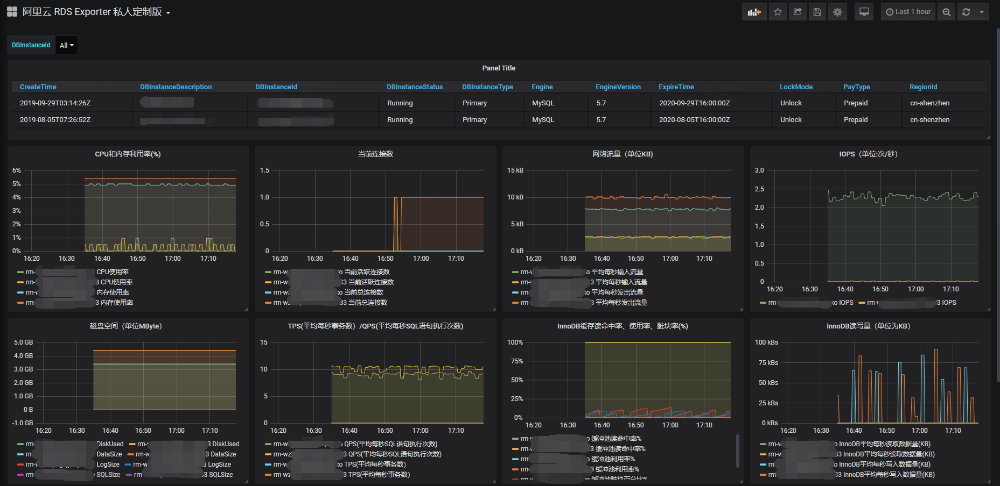

# Description

A prometheus exporter for Aliyun RDS Instance.

<font color='red'>Just a demo!</font>

<font color='red'>Do not use for production!</font>

<font color='red'>Only RDS for MySQL has tested!</font>

# Set Environment for Docker build 

```shell
export IMAGE_NAME=my_aliyun_rds_exporter
export TAG=v0.01
```

# Build Docker Image

```shell
docker build -t ${IMAGE_NAME}:${TAG} .
```

# Edit configuration file

- copy configuration file

```shell
cp config/config.yaml.example config/config.yaml
```

- Config your credential and interested metrics

  > Visit [here](https://www.alibabacloud.com/help/doc-detail/26316.htm?spm=a2c63.p38356.b99.764.1d5b6457y4HDHR) for more metrics informations!
  >
  > for Chinese Version visit [here](https://help.aliyun.com/document_detail/26316.html?spm=a2c1g.8271268.0.0.2e90df25B78c0i)!

```yaml
credential:
  access_key_id: <YOUR_ACCESS_KEY_ID>
  access_key_secret: <YOUR_ACCESS_KEY_SECRET>
  region_id: <REGION_ID>
performance_list:
  MySQL:
  # Average inbound traffic to a MySQL instance per second and average outbound traffic from a MySQL instance per second. Unit: KB. 
  - 'MySQL_NetworkTraffic'
  #  Average number of SQL statement execution times per second and average number of transactions per second 
  - 'MySQL_QPSTPS'
```

# Quick Start

- Run exporter in container

```shell
docker run -d \
           --restart=on-failure:5 \
           -p 5234:5234 \
           -v config/config.yaml:/opt/aliyun-rds-exporter/config/config.yaml \
           ${IMAGE_NAME}:${TAG}
```

- Qurey metrics data

```shell
curl http://localhost:5234/metrics
```

# Metrics data Samples

## Aliyun API Request Metrics

```shell
...
# HELP aliyun_api_request_latency_seconds CloudMonitor request latency
# TYPE aliyun_api_request_latency_seconds summary
aliyun_api_request_latency_seconds_count{api="DescribeDBInstancesRequest"} 1.0
aliyun_api_request_latency_seconds_sum{api="DescribeDBInstancesRequest"} 0.35166287422180176
aliyun_api_request_latency_seconds_count{api="DescribeDBInstancePerformanceRequest"} 17.0
aliyun_api_request_latency_seconds_sum{api="DescribeDBInstancePerformanceRequest"} 32.744452476501465
# TYPE aliyun_api_request_latency_seconds_created gauge
aliyun_api_request_latency_seconds_created{api="DescribeDBInstancesRequest"} 1.5696814557247128e+09
aliyun_api_request_latency_seconds_created{api="DescribeDBInstancePerformanceRequest"} 1.5696814559071503e+09
....
```

## Aliyun RDS Performance Metrics

```shell
# HELP aliyun_rds_performance_MySQL_NetworkTraffic_recv_k
# TYPE aliyun_rds_performance_MySQL_NetworkTraffic_recv_k gauge
aliyun_rds_performance_MySQL_NetworkTraffic_recv_k{Unit="KB",instanceId="rm-xxxxxxxxxxxxxxxxx"} 2.6
# HELP aliyun_rds_performance_MySQL_NetworkTraffic_sent_k
# TYPE aliyun_rds_performance_MySQL_NetworkTraffic_sent_k gauge
aliyun_rds_performance_MySQL_NetworkTraffic_sent_k{Unit="KB",instanceId="rm-xxxxxxxxxxxxxxxxx"} 9.9
# HELP aliyun_rds_performance_MySQL_QPSTPS_QPS
# TYPE aliyun_rds_performance_MySQL_QPSTPS_QPS gauge
aliyun_rds_performance_MySQL_QPSTPS_QPS{Unit="int",instanceId="rm-xxxxxxxxxxxxxxxxx"} 10.25
# HELP aliyun_rds_performance_MySQL_QPSTPS_TPS
# TYPE aliyun_rds_performance_MySQL_QPSTPS_TPS gauge
aliyun_rds_performance_MySQL_QPSTPS_TPS{Unit="int",instanceId="rm-xxxxxxxxxxxxxxxxx"} 0.0
```

## Aliyun RDS Resource Usage Metrics

```shell
...
# HELP aliyun_rds_resource_usage_LogSize
# TYPE aliyun_rds_resource_usage_LogSize gauge
aliyun_rds_resource_usage_LogSize{Engine="MySQL",instanceId="rm-xxxxxxxxxxxxxxxxx"} 2.097152e+06
# HELP aliyun_rds_resource_usage_DataSize
# TYPE aliyun_rds_resource_usage_DataSize gauge
aliyun_rds_resource_usage_DataSize{Engine="MySQL",instanceId="rm-xxxxxxxxxxxxxxxxx"} 4.395630592e+09
# HELP aliyun_rds_resource_usage_DiskUsed
# TYPE aliyun_rds_resource_usage_DiskUsed gauge
aliyun_rds_resource_usage_DiskUsed{Engine="MySQL",instanceId="rm-xxxxxxxxxxxxxxxxx"} 4.397727744e+09
...
```

## Aliyun RDS Status Metrics

> The metrics value will always be a float number `1.0`.
>
> Just for label RDS instance status!

```shell
# HELP aliyun_rds_status 
# TYPE aliyun_rds_status gauge
aliyun_rds_status{CreateTime="2019-01-01T08:00:00Z",DBInstanceId="rm-xxxxxxxxxxxxxxxxx",DBInstanceStatus="Running",DBInstanceType="Primary",Engine="MySQL",EngineVersion="5.7",ExpireTime="2020-01-01T16:00:00Z",LockMode="Unlock",PayType="Prepaid",RegionId="cn-shenzhen"} 1.0
```

# Run in kubernetes

## edit YAML file

- edit `kubernetes/aliyun-rds-exporter-configmap.yaml`
- Config your credential and interested metrics

```yaml
    # aliyun key_id and key_secret
    credential:
      access_key_id: "<Aliyun Access Key ID>"
      access_key_secret: "<Aliyun Access Key Secret>"
      region_id: "<Aliyun Region>"
```

## deploy

```shell
kubectl apply -f kubernetes/
```

# Grafana Dashboard

## import dashboard

JSON panel code locate in `grafana/grafana-dashboard.json`

## screen

